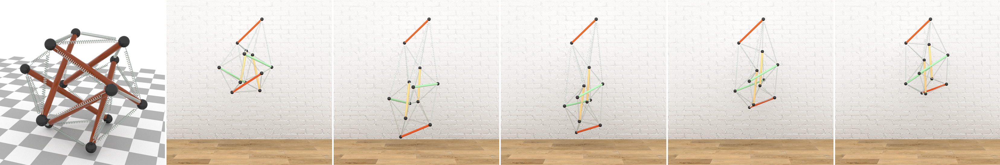

# **Rendering Tools and Utilities**
Jump to
- [Table of Contents](#contents)
- [Maya, Blender, RenderMan, Houdini](#content-creation-softwares)
- [Publications](#publications)


Figure: A collection of renderings from the [publications](#publications).
## Preface
This is a growing collection of tools used to generate offline renderings and animation for research in Computer Graphics at [Laboratory for Interactive Virtual Environments (**LIVE**)](https://orionquest.github.io/research.html). **LIVE** is directed by [Mridul Aanjaneya](https://orionquest.github.io/index.html) at Department of Computer Science, Rutgers University. This collection is created and maintained by [Chengguizi Han](https://laurelch.github.io/) from **LIVE**. Any questions and suggestions are welcome.

Huge thanks to all other contributors to the [publications](#publications):

- The members (and alumni) of **LIVE**: Dr. Tao Xue, [Haozhe Su](https://soldierdown.github.io/projects/).
- [Prof. Chenfanfu Jiang](https://www.math.ucla.edu/~cffjiang/) at UCLA Mathematics.
- Kun Wang and [Prof. Kostas Bekris](https://robotics.cs.rutgers.edu/pracsys/members/kostas-bekris/) at Rutgers Robotics PRACSYS Group.

## Contents
- [Get Started](#get-started): introduction to softwares, tools, and general rendering process
- [Bash Commands](#bash-commands): commonly used bash commands
- [Bash Scripts](#bash-scripts): commonly used bash scripts that takes inputs
- [Python Scripts](#python-scripts): uses python from shell
- [Content Creation Softwares](#content-creation-softwares): download pages and recommended tutorials
  - [Maya](#maya):
    - Python for Maya [cheat-sheet](py-maya-cheat-sheet.md)
    - install Maya on Ubuntu [guide](maya-install-ubuntu.md)
  - [Blender](#blender)
  - [RenderMan](#renderman)
  - [Houdini](#houdini)
    - convert particles to mesh [guide](houdini-particles-to-mesh.md)
- [Q&A](#qa): common questions
- [Resources](#resources): other useful resources
- [Publications](#publications): more examples using this rendering process

## Get Started
- Softwares or tools recommended:
  - **[Maya](#maya)** or [Blender](#blender)
    - for 3D content creation: modeling, animation
    - use with renderer plugin
  - **RenderMan** and **RenderMan for Maya**
    - standalone renderer and its plugin: shading, lighting
    - can render with RIB (**R**enderMan **I**nterface **B**ytestream) file with command
        ```
        prman -progress <file-name>.rib
        ```
  - **Python**
    - **Python for Maya** ([cheat-sheet](py-maya-cheat-sheet.md)): batch modification in Maya
    - batch rendering with RIB files
  - Houdini
    - convert particles to mesh
  - Mitsuba renderer 0.6 utilities
    - convert EXR to PNG with
      ```
      mtsutil tonemap -t *.exr
      ```
- General Process Description
  1. **Modeling**
     - low-poly modeling
     - meshing from particles, with [Houdini](#houdini)
     - find free 3D models at [turbosquid](https://www.turbosquid.com/), [sketchfab](https://sketchfab.com/feed)
     - find and follow tutorial for 3D modeling
  2. UV Editing *(optional)*
  3. **Shading** (Textures, Materials)
     - use renderer's shading node (e.g [PxrSurface](https://rmanwiki.pixar.com/display/REN24/PxrSurface) with RenderMan)
     - find free textures at [textures.com](https://www.textures.com/library)
  4. Lighting
     - use renderer's lighting node (e.g [PxrDomeLight](https://rmanwiki.pixar.com/display/REN24/PxrDomeLight) with RenderMan)
  5. Camera
     - set aspect ratio, usually 1240x1024
  6. Animation
     - with built-in tools
     - **with data**, using Python (for Maya)
  7. Rendering
     - with built-in renderer (e.g Arnold in Maya, Cycles in Blender)
     - with plug-in renderer (e.g RenderMan in Maya or Blender)
     - **with standalone renderer** (e.g. RenderMan): export RIB files from Maya, then render with bash commands and Python
    <!-- - convert particles to mesh, [quick guide](houdini-particles-to-mesh.md) -->

## Bash Commands
- Check out [cheat-sheet](cheat-sheet.md) for commonly used commands:
  - [Multiplexer](cheat-sheet.md#multiplexer)
  - [Filename manipulation](cheat-sheet.md#filename-manipulation)
  - [Post-processing](cheat-sheet.md#post-processing)
  - [Video](cheat-sheet.md#video)
  - [Storage](cheat-sheet.md#storage)
  - [Renew RenderMan on Ubuntu](cheat-sheet.md#renew-renderman)

## Bash Scripts
Check out [bash](bash) folder for bash scripts (**.sh** files for Linux, **.bat** files for Windows):
  - [ccrop.sh](bash/ccrop.sh): crop with target center, and target width and height
  - [convert.bat](bash/convert.bat): batch convert EXR files to PNG files
  - [deleteLines.sh](bash/deleteLines.sh): delete lines in (RIB) files with line numbers and from the file end
  - [makeVideo.sh](bash/makeVideo.sh): make video for a given folder with given name
  - [replace.sh](bash/replace.sh): replace strings for all (RIB) files in a folder
  - [vcrop.sh](bash/vcrop.sh): crop left and right of an image with target width

## Python Scripts
- [render.py](python/render.py): specifies dataset and batch render RIB files

## Content Creation Softwares
### Maya
- Industry standard software
- Free education version available, renews every year
- Download education version at https://www.autodesk.com/education/edu-software/overview
- Recommended tutorial:
  - [Intro to Maya Series](https://www.youtube.com/watch?v=LJLo6MafPVM) by Maya Learning Channel @YouTube
  - Maya 2019 Fundamentals @PluralSight, [preview](https://www.youtube.com/watch?v=ez6GSrMtFYI)
- Check out my [cheat-sheet](py-maya-cheat-sheet.md) for **Python for Maya** :
  - [Import](py-maya-cheat-sheet.md#import)
  - [Objects](py-maya-cheat-sheet.md#objects)
  - [Transformation](py-maya-cheat-sheet.md#transformation)
  - [Shading](py-maya-cheat-sheet.md#shading)
  - [Animation](py-maya-cheat-sheet.md#animation)
- To install Maya on **Ubuntu**, check this [install guide](maya-install-ubuntu.md) that worked for me

### Blender
- Free, open-source, handy, and beginner-friendy
- Download at https://www.blender.org/
- Recommended tutorial:
  - [Grant Abbitt](https://www.youtube.com/channel/UCZFUrFoqvqlN8seaAeEwjlw) @YouTube, and his complete beginners [guide](https://www.youtube.com/watch?v=wNQYhbvTJi8)

### RenderMan
- Free non-commercial license available, renews every 3 months
- Download at https://renderman.pixar.com/store
- Recommended tutorial:
  - [RenderMan Docs](https://rmanwiki.pixar.com/display/REN24/RenderMan): official RenderMan Docs, installation guides, plugins guides
  - [Learn RenderMan](https://renderman.pixar.com/learn): official RenderMan learning resources
  - [Small Robot Studio](https://www.youtube.com/channel/UCvRPmhwzn2pFdLes0vcTeJQ) @YouTube: learn specific RenderMan shading features

### Houdini
- Procedural generation software, commonly used for visual effects
- Many versions, including free and indie version, avaialble at https://www.sidefx.com/buy/
- Recommended tutorial:
  - [Learning Houdini](https://www.sidefx.com/learn/getting_started/): official SideFX get started tutorial
- Check out options to use houdini for [meshing](houdini-particles-to-mesh.md)

## Q&A
1. **Q**: What OS should I use? 
   <br> **A**: You can use the OS that you're most comfortable with to get started. Most softwares support Windows, Mac OS, and Linux. Since rendering is a time-consuming and expensive work, when you need to render animation, you may want to utilize other machine(s) with a different OS. We will add more about transferring contents between different OS.

## Resources 
- Bash scripting cheatsheet: [devhints.io/bash](https://devhints.io/bash)
- Python for Maya commands: [Docs (2017 version)](https://help.autodesk.com/cloudhelp/2017/ENU/Maya-Tech-Docs/CommandsPython)
- Udemy: 3D and Animation [courses](https://www.udemy.com/courses/design/3d-and-animation/), high-quality with regular discounts

## Publications
Publications using the rendering process:
<br>(latest publication first)
- **A Unified Second-Order Accurate in Time MPM Formulation for Simulating Viscoelastic Liquids with Phase Change**
  <br> Haozhe Su*, Tao Xue*, Chengguizi Han, Chenfanfu Jiang and Mridul Aanjaneya (*Joint first authors)
  <br> _ACM Transactions on Graphics_, (SIGGRAPH proceedings), 40, 4, 119:1-18, (2021)
  
  
  <br> [Paper page](https://orionquest.github.io/papers/USOSVLPC/paper.html): Paper | BibTeX | Video | Code
  <br> Featured in [SIGGRAPH Technical Papers Video Trailer](https://youtu.be/Ros7ZXqLbFg?t=164), starting at 2:44
- **A Novel Discretization and Numerical Solver for Non-Fourier Diffusion**
  <br> Tao Xue*, Haozhe Su*, Chengguizi Han, Chenfanfu Jiang and Mridul Aanjaneya (*Joint first authors)
  <br> _ACM Transactions on Graphics_, (SIGGRAPH Asia proceedings), 39, 6, 178:1-14, (2020)

    
  [Paper page](https://orionquest.github.io/papers/NDNSNFD/paper.html): Paper | BibTeX | Video | Code
- **A First Principles Approach for Data-Efficient System Identification of Spring-Rod Systems via Differentiable Physics Engines**
   <br> Kun Wang, Mridul Aanjaneya and Kostas Bekris
   <br> _Proceedings of Machine Learning Research_, (2nd Annual Conference on Learning for Dynamics and Control), 120:1-15, (2020)

    
   <br>[Paper page](https://orionquest.github.io/papers/FPADSISRS/paper.html): Paper | BibTeX | Video
- **An Efficient Geometric Multigrid Solver for Viscous Liquids**
  <br> Mridul Aanjaneya*, Chengguizi Han, Ryan Goldade and Christopher Batty (*Lead and supervising author)
  <br> _Proceedings of the ACM in Computer Graphics and Interactive Techniques_, (SCA proceedings), 2, 2, 14:1-21, (2019)
  
    
  <br>[Paper page](https://orionquest.github.io/papers/EGMVL/paper.html): Paper | BibTeX | Video

<!--
TODO:
1. add python code to convert TXT (files with particle coordinates) to OBJ/RIB
   1. sphere size
   2. color
   3. camera positions
2. add useful shaders in RIB format
   AttributeBegin Bxdf "PxrSurface" "paper" "float diffuseGain" [1] "color diffuseColor" [0.751 0.751 0.751] "float diffuseRoughness" [0.4] AttributeEnd
3. process to use RenderMan in Maya
   1. Render Settings
4. 3=> detailed whole process
-->