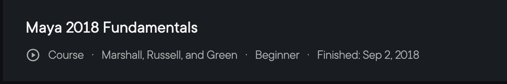
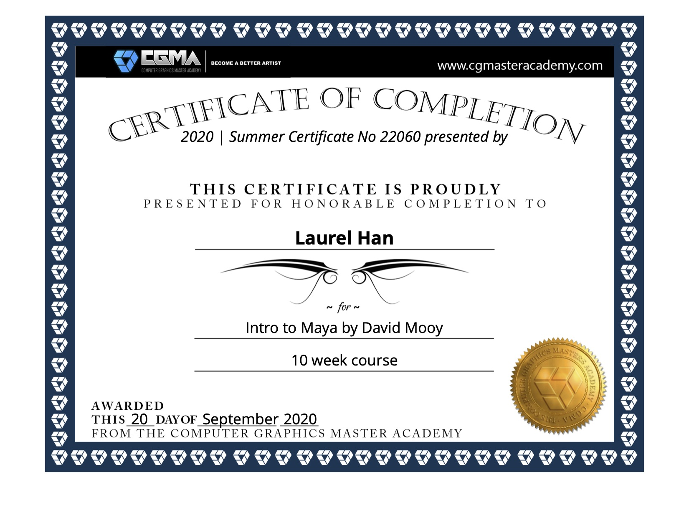
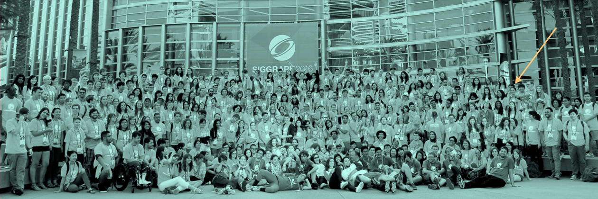

# **🐰 Rendering is awesome❣️**

- _For beginners & CG lovers who don't just want to appreciate but also want to create._

- _For friends who are curious about my personal experiences._
___

This page is about my experiences and stories on rendering in my research work, and content creations as a hobbist and **art lover**. Most commands I use can be found at a rendering [cheat-sheet](cheat-sheet.md) I created.

Although I only did offline rendering in my past work, I am also greatly interested in real-time rendering as a **programmer**, but this page only focuses on offline rendering.

I will talk about the tools and pipeline I use, and also about what excites and motivates me. I hope my experiences can help you get started with your journey and keep motivated willingly.

I mainly rendered with renderer [Pixar's RenderMan](https://renderman.pixar.com/), which is available with free non-commercial version.

I am also very fond of [Blender](https://www.blender.org/), which is light-weight and open-source. RenderMan 24 now officially supports Blender, but I have not tried it out yet.

## **Catalog 🎼**
1. [Pipeline](#pipeline): steps to produce rendering
2. [Software](#software): 3D softwares I use in the pipeline
   - [Maya](#maya) 
   - [RenderMan](#renderman)
   - [Blender](#blender)
   - (Coming Soon...) [Houdini](#houdini)
   - (Coming Soon...) [Unity](#unity)
3. (Coming Soon...) [Resources](#resources): Helpful resources that help me learn, generate interests, or maintain motivation

## **Pipeline 🏗️**
This is my general rendering pipeline. 
1. **Modeling**
   1. low-poly modeling
   2. meshing from particles
2. UV Editing*
3. **Shading** (Textures, Materials)
4. Lighting
5. Camera
6. Animation
   1. with built-in tools
   2. **with data**
7. Rendering
   1. with built-in renderer
   2. **with standalone renderer**

\* = optional, **bold** = important
## **Software 💻**
Please allow me to introduce the softwares or tools that I use in my pipeline, and how I **learnt** them.

I do not understand every parts of a software well, so I will mention what I use this software for.
___
Side note: 

    Don't get frightened for all the available softwares out there! 
    
    Understanding one suitable 3D software may be enough for all steps in the pipeline. 
    
    You will get comfortable (and even excited!) to explore different tools after you can produce something you have imagined in yourself for years.

___
### **Maya 🍏**
___
_I use for all = modeling, UV Editing, shading, lighting, camera, animation, rendering_

Maya by Autodesk is the first 3D software I learnt. It provides [educational license](https://www.autodesk.com/education/edu-software/overview) that can be renewed every year. It is widely-used for modeling and rigging in CG industry, but can also handle jobs like special effects and animation. 

### **Pluralsight**: "Maya 2018 Fundamentals" by Justin Marshall, Eddie Russell, and Kyle Green
I started with a [PluralSight](https://app.pluralsight.com/) course of ["Maya 2018 Fundamentals"](https://app.pluralsight.com/library/courses/maya-2018-fundamentals/table-of-contents), which I completed on Sept 2, 2018. 

This is a course that takes you make a small but exciting project, a flying sailship for the Maya 2018 version I completed, and a futuristic drone for the [Maya 2019 version](https://app.pluralsight.com/library/courses/maya-2019-fundamentals-overview-modeling/table-of-contents). The course covers all the basics that you need to learn in digital content creation.

All of the intructors were great teachers and presenters. I never lost motivation in the process of following this course. Only when I started rendering on my beloved Macbook Pro 2016, I found that it crashed during rendering. I knew for the first time that rendering is such a hard work.

### **CG Master Academy (CGMA)**: "Intro to Maya" by David Mooy
Since I was very interested in creating digital environment, I started looking for more advanced and professional courses in environment modeling with a path that one can follow and some sort of certificate. 

I contacted [Academy of Art University](https://www.academyart.edu/) and [CGMA](https://www.cgmasteracademy.com/). I was interested in the online degree in [Game Development](https://www.academyart.edu/academics/game-development/) at AAU, and [3D Environment Arts Track](https://www.cgmasteracademy.com/programs/5-3d-environment-arts-track/) at CGMA.

The advisor, Hanzhen Li, from AAU was very responsive and caring, and answered my question by actually asking the instructors from the departments. I was considering whether I should choose Animation & VFX department or Game Development department if I am interested in environment modeling. He said the impression is that Game Development is recommended over the other, because the job market is much larger and all the graduates were hired, plus the skills learnt in Game Development can be applied to Animation, but not so much the other way around.

I did not end up choosing AAU because if I were going to take the Masters (MA or MFA) degree, it will take too much effort beside my own work. I defintely recommend people who have interests consider this place for onsite or online learning experiences.

I liked CGMA so much because they offer "[tracks](https://www.cgmasteracademy.com/programs/)" that make the directions very clear. I was interested in the [3D Environment Arts Track](https://www.cgmasteracademy.com/programs/5-3d-environment-arts-track/), and kept checking it for months, coming back every other week or so. I finally determined to take this in Summer 2020, and finished in Sept, 2020.

"[Intro to Maya](https://www.cgmasteracademy.com/courses/53-intro-to-maya/)" is the first class required for 3 tracks at CGMA: 3D character art, 3D environment art, and character TD. It is a 10-week class with pre-recorded course video, and assignment each week that you can receive individual screen recorded feedback from instructor. David actually opened our files, played around, and show how to fix the problems. Yes, you can view your classmate's submissions and feedback as well. The classroom platform of CGMA also meet all my needs, and was largely updated before I started the course.

I really love hearing the comments from David and seeing him manipulating my work. I always smiled while listening him saying "Laurel, it was great!" I wish I could have more time following his other classes in the future.

In CGMA, you can choose your pace to take individual classes, but still has clear tracking for your ambitions. This is the biggest reason I choose them, and wish you can recommend me if you have other great options.

___
### **RenderMan 🔷**
___
_I use for shading, lighting, camera, rendering_

Pixar's RenderMan is a photorealistic 3D rendering software produced by Pixar Animation Studios. The first time I encountered this software is when I attend an event at SIGGRAPH 2016 after finishing my shift of student volunteer on one day. 

_Image: All student volunteers at SIGGRAPH 2016. Me pointed by the orange (our T-shirt color!) arrow._

I attended an event hosted by Pixar at night, presented with all special versions of the walking teapot. I did not quite understand what was that, and I wandered around to see people talking in front of a few screens. They were showing some advanced software that I don't remember what they are. I didn't talk to anyone, and was alone with my biscuits and grapes. I had no energy, because I was food poisoned on the first night I arrived, and went to ER for the first time in my life until 5AM. But I do remember "RenderMan" after coming out of the event, probably because the name itself was self-explanatory and easy to remember.

Later, in the reseach, RenderMan was the best option because its support for batch rendering with RIB files, and suggested by my advisor to pick this up. It was quite hard for me in the beginning to think about rendering without GUI.

I took a class of "[Fundamentals of RenderMan for Maya](https://app.pluralsight.com/library/courses/renderman-maya-introduction/table-of-contents)" on Pluralsight to get familiar with RenderMan right after I finished the class of Maya.

This is a helpful intro to RenderMan for Maya, but it was relatively outdated with Maya 2017 and RenderMan 21. I wasn't very excited for this class.

After getting to know some facts, and digging into the old version of RenderMan docs, I became more and more comfortable working with RenderMan RIB files. I learnt how camera is used by matrix, and all matrices are presented as arrays in the RIB file. I learnt that all paramters available in Maya GUI are the same there in RIB file. I learnt about "ReadArchive", "RiBlobby" (but did not use it), "Sphere", "PxrSurface", and so on. 

In this process, I found A YouTube channel: [Small Robot Studio](https://www.youtube.com/channel/UCvRPmhwzn2pFdLes0vcTeJQ) super helpful. The youtuber was a great presenter, his voice is clear and genteel. I love the cute small robot that he uses each time for explanation. 

___
### **Blender 🍊**
___
_I want to use for all, but still in learn_

[Blender](https://www.blender.org/) is a free, open-source, light-weight 3D CG software. After following some tutorials on YouTube, it was definetly very beginner friendly, and the GUI design looks modern. 

Some shortcuts were super helpful, like the number keys, grab (G), scale (S), Rotate (R), and followed by X/Y/Z to constrain. Some UI design was super cool, like having the freedom to create a window between any intersection of windows. I feel that I cannot get back once I get more comfortable with Blender! 

I followed a YouTube channel by [Grant Abbitt](https://www.youtube.com/channel/UCZFUrFoqvqlN8seaAeEwjlw), he is simply the best! 

Blender has plenty of free tutorials or demo on YouTube with high quality. I don't have other resources to recommend for now.

___
### **Houdini**
___
(Coming soon...)

### **Unity**
___
(Coming soon...)

## **Resources**
(Coming soon...)

[ first version on 7/13/2021 ]......[ last updated on 7/13/2021 ]
